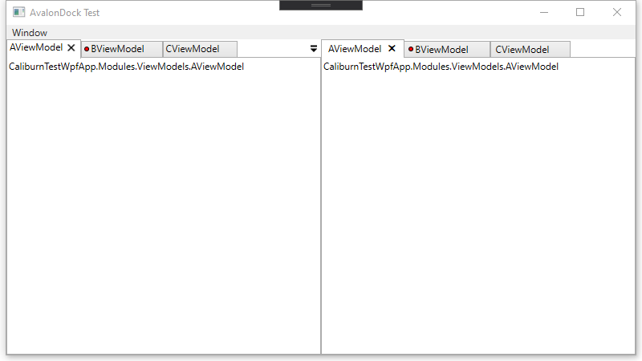

# AvalonDock and Caliburn Close Application Issue

This test application demonstrates an issue with AvalonDock and Caliburn.Micro:

* [Dirster.AvalonDock](https://github.com/Dirkster99/AvalonDock) v4.30.0
* [Caliburn.Micro](https://caliburnmicro.com/) v4.0.136-rc

## Description

Using AvalonDock and Caliburn.Micro, if a displayed item overrides the `Screen.CanCloseAsync` method and at least one item returns false (cannot close), the DockingManager disappears even though the items are still present in the collection.

# Reproduction Steps

1. Start CaliburnDockWpfApp

2. Click the main application close "X" button, and a message box appears for BViewModel

3. Click the "No" button in the message box. The Docking Manager disappears

4. If you click the main application close "X" button again, you are prompted again because B never closed

5. Snoop shows the `PART_SelectedContentHost` is empty and Width is 0.

6. If you use the menu to recreate A, B, and C, only A and C are visible in AvalonDock. This is because B was never actually closed and still exists, just not shown in AvalonDock.

